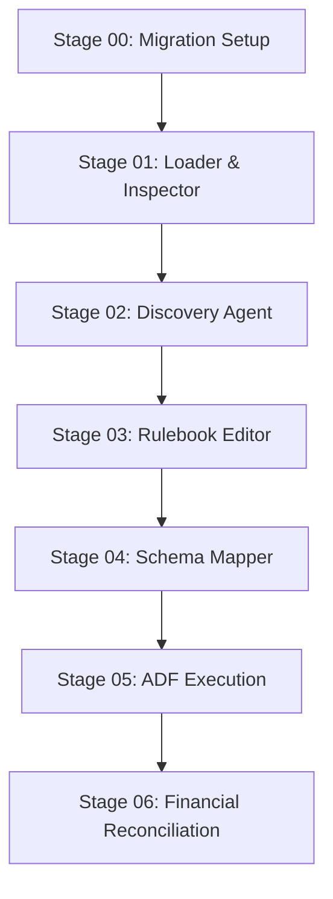

# Data Migration Control Plane & Agentic Workbench

An enterprise-grade, metadata-driven control plane and agentic workbench for managing complex acquisition-to-target data migrations. Built with a **FastAPI (Python) Control Plane Backend**, a **declarative Markdown Rulebook Compiler**, and a **dynamic vanilla ES module UI**, the platform provides persona-based governance (**Migration Analyst** vs. **Validation Specialist**) and human-in-the-loop (HITL) approval state machines.

---

## 1. Product Blueprint & Architectural Model

The platform keeps the reusable migration engine common across all acquisitions while encapsulating acquisition-specific behavior in metadata, source/target contracts, value crosswalks, Markdown rulebooks, validation rules, and storage adapters.

```text
 ┌────────────────────────────────────────────────────────────────────────────────────────┐
 │                              UI EXPERIENCE LAYER (ES Modules)                          │
 │   Persona 1: Migration Analyst (Control Plane)  │  Persona 2: Validation Specialist (Data) │
 └───────────────────────────┬──────────────────────────────────┬─────────────────────────┘
                             │ REST API                         │ REST API
 ┌───────────────────────────▼──────────────────────────────────┴─────────────────────────┐
 │                            FASTAPI CONTROL PLANE BACKEND                               │
 │  ┌─────────────────────────┐  ┌─────────────────────────────┐  ┌─────────────────────┐  │
 │  │ Knowledge & MD Compiler │  │ Agent Orchestrator Engine   │  │ Approval & Audit    │  │
 │  └────────────┬────────────┘  └──────────────┬──────────────┘  └──────────┬──────────┘  │
 └───────────────┼──────────────────────────────┼────────────────────────────┼─────────────┘
                 │ Read Rules                   │ Input / Output             │ Artifact
 ┌───────────────▼──────────────────────────────▼────────────────────────────▼─────────────┐
 │                         STORAGE & CONNECTOR LAYER (Hybrid)                             │
 │  ┌────────────────────────────────────────┐  ┌───────────────────────────────────────┐  │
 │  │ Local File Storage / App_Data Storage  │  │ Cloud Storage Connectors (ADLS / AWS) │  │
 │  └────────────────────────────────────────┘  └───────────────────────────────────────┘  │
 └──────────────────────────────────────────────┬──────────────────────────────────────────┘
                                                │ Transformed Package (.sql / .json)
 ┌──────────────────────────────────────────────▼──────────────────────────────────────────┐
 │                        TARGET EXECUTION ENGINE (ADF / AMK)                             │
 │  ADF Pipelines -> Azure SQL / AMK Target Contracts (Morningstar multi-custodian schema) │
 └─────────────────────────────────────────────────────────────────────────────────────────┘

```

### Core Architectural Principles

* **Plane Decoupling**: The Control Plane governs definitions, business rules, and approvals. The Data Plane performs reads, transformations, validations, loads, and reconciliations against actual data.


* **Business Movement**: `SOURCE -> PROCESSED -> TRANSFORMED -> TARGET`.


* **Immutable Evidence**: RAW files are stored with SHA-256 checksums, dataset IDs, processing IDs, and feed instance IDs.


* **Configuration Over Code**: Acquisition-specific file paths, codes, mappings, and rules exist in versioned metadata.


---

## 2. Canonical Data Model Scope

The canonical model provides a stable semantic boundary that preserves relationships, target requirements, and lineage.

| Canonical Domain | Primary Entities | Scope & Design Considerations |
| --- | --- | --- |
| **Identity & Relationships** | Firm, Registered Person, Advisor, Household, Party, Relationship | Source keys, primary/shared advisor links, household display names.

 |
| **Account** | Account, Registration, Custodian Account, Account Status | Lifecycle, registration crosswalks, custodian assignment.

 |
| **Portfolio** | Security, Position, Tax Lot, Model, UMA Allocation, Restriction | CUSIP crosswalks, quantities, market value, cost basis, target weights.

 |
| **Activity** | Transaction, SWP/RMD, Cash Flow, AUM/Flow, Realized Gain/Loss | Transaction codes, sign conventions, trade/settlement dates.

 |
| **Fees & Billing** | Fee Schedule, Negotiated Fee, Billing Period, Billable Activity | Rates, caps, tiers, advance vs. arrears billing method.

 |
| **History & Audit** | Performance, Reconciliation, Source Record, Migration Exception | Inception/cutover windows, gross/net returns, cash flows.

 |

---

## 3. Project Directory Structure

```text
data-migration-workbench/
├── app/                                  # FastAPI Application Backend[cite: 7]
│   ├── main.py                           # Control Plane REST API routes & app entrypoint[cite: 7]
│   ├── models.py                         # Pydantic schemas & request validation[cite: 2, 7]
│   ├── db.py                             # Control plane persistence (SQLite DDL & connection)[cite: 2, 7]
│   ├── storage.py                        # Hybrid storage manager (Local + ADLS/S3 hooks)[cite: 7, 10]
│   ├── compiler/
│   │   ├── rulebook.py                   # Executable Markdown rulebook compiler[cite: 1, 7]
│   │   └── expressions.py                # Safe expression evaluator (PERIOD_START, TOKENIZE)[cite: 1]
│   └── execution/
│       ├── local_executor.py             # Local transformation & reconciliation executor[cite: 7, 11]
│       └── adf_exporter.py               # ADF / Cloud package export handler[cite: 8, 10]
│
├── sample-data/                          # Migration Templates & Sample Packs[cite: 1, 15]
│   └── migrations/
│       └── morningstar-multicustodian/   # Morningstar multi-custodian benchmark pack[cite: 1, 6, 11]
│           ├── knowledge/                # Knowledge base assets (.json, .md)[cite: 1]
│           └── source/                   # Executable sample extracts (.csv, .psv)[cite: 1, 15]
│
├── static/                               # Vanilla ES Modules Frontend[cite: 8, 12, 13]
│   ├── prototype.html                    # Root HTML frame[cite: 7, 12]
│   ├── prototype.js                      # UI state manager & stage router[cite: 7, 11, 12]
│   ├── prototype.css                     # Active visual design system styling[cite: 8, 12]
│   └── components/                       # Stage & Persona Components[cite: 12]
│       ├── login.js                      # Identity authentication modal[cite: 8, 12, 13]
│       ├── role-selection.js             # Persona selector[cite: 8, 12, 13]
│       ├── workspace-shell.js            # Workspace frame & stage navigation[cite: 7, 12]
│       ├── migration-setup.js            # Stage 00: Migration Setup[cite: 2, 7, 12]
│       ├── migration-knowledge.js        # Knowledge Base preview & edit modal[cite: 1, 2, 7, 12]
│       ├── ingestion.js                  # Stage 01: Loader & Ingestion Inspector[cite: 1, 8, 10, 12]
│       ├── discovery.js                  # Stage 02: Discovery Agent & Profiler[cite: 1, 6, 8, 10]
│       ├── rulebook-editor.js            # Stage 03: Markdown Rulebook Authoring[cite: 1, 7, 12]
│       ├── rule-editor.js                # Stage 04: Schema Mapper & Rule Reruns[cite: 2, 8, 10, 12]
│       ├── execution.js                  # Stage 05: ADF Execution & Export[cite: 8, 10, 12]
│       └── reconciliation.js             # Stage 06: Financial Reconciliation[cite: 8, 10, 12]
│
├── App_Data/                             # Local Persistence Directory[cite: 3, 11]
│   ├── controlplane.db                   # SQLite database[cite: 2, 3, 11]
│   └── Storage/                          # Local RAW & TRANSFORMED storage[cite: 2, 3, 11]
│
├── requirements.txt                      # Dependencies[cite: 3, 11]
├── run.py                                # Cloud-ready server entrypoint[cite: 3, 11]
└── README.md                             # Repository Documentation

```

---

## 4. Backend Implementation Specifications

### 4.1 Persistence Schema (`app/db.py`)

Control-plane metadata tables enforce uniqueness, audit trails, and versioning.

```python
import sqlite3
from pathlib import Path

DB_PATH = Path("App_Data/controlplane.db")

def get_db_connection() -> sqlite3.Connection:
    DB_PATH.parent.mkdir(parents=True, exist_ok=True)
    conn = sqlite3.connect(DB_PATH)
    conn.row_factory = sqlite3.Row
    return conn

def init_db() -> None:
    """Creates control-plane tables using idempotent DDL[cite: 3]."""
    conn = get_db_connection()
    cursor = conn.cursor()

    cursor.execute("""
        CREATE TABLE IF NOT EXISTS migrations (
            id TEXT PRIMARY KEY,
            name TEXT UNIQUE NOT NULL,
            category TEXT,
            description TEXT,
            source_system TEXT,
            target_system TEXT,
            entities_json TEXT,
            template_id TEXT,
            created_by TEXT,
            created_utc TEXT NOT NULL
        );
    """)

    cursor.execute("""
        CREATE TABLE IF NOT EXISTS migration_rulebooks (
            migration_id TEXT PRIMARY KEY,
            content TEXT NOT NULL,
            updated_by TEXT,
            updated_utc TEXT NOT NULL,
            FOREIGN KEY (migration_id) REFERENCES migrations (id)
        );
    """)

    cursor.execute("""
        CREATE TABLE IF NOT EXISTS runs (
            id TEXT PRIMARY KEY,
            source_system_id TEXT,
            target_system_id TEXT,
            migration_id TEXT NOT NULL,
            status TEXT NOT NULL,
            canonical_model_version TEXT,
            created_by TEXT,
            created_utc TEXT NOT NULL,
            updated_utc TEXT NOT NULL
        );
    """)

    cursor.execute("""
        CREATE TABLE IF NOT EXISTS run_input_files (
            id TEXT PRIMARY KEY,
            run_id TEXT NOT NULL,
            file_order INTEGER,
            file_name TEXT NOT NULL,
            entity_name TEXT,
            dataset_id TEXT,
            processing_id TEXT,
            feed_instance_id TEXT,
            relative_path TEXT NOT NULL,
            content_type TEXT,
            layer TEXT DEFAULT 'RAW',
            size_bytes INTEGER,
            sha256 TEXT,
            created_utc TEXT NOT NULL,
            FOREIGN KEY (run_id) REFERENCES runs (id)
        );
    """)

    cursor.execute("""
        CREATE TABLE IF NOT EXISTS approvals (
            id TEXT PRIMARY KEY,
            run_id TEXT NOT NULL,
            artifact_id TEXT,
            stage TEXT NOT NULL,
            decision TEXT NOT NULL,
            reviewer TEXT NOT NULL,
            comments TEXT,
            created_utc TEXT NOT NULL,
            FOREIGN KEY (run_id) REFERENCES runs (id)
        );
    """)

    conn.commit()
    conn.close()

```

### 4.2 Safe Expression Engine (`app/compiler/expressions.py`)

Evaluates transformation expressions without dangerous string evaluation (`eval()`).

```python
import re
from datetime import datetime
from typing import Any, Dict, Optional

class ExpressionEvaluator:
    VAR_PATTERN = re.compile(r"\{\{\s*([a-zA-Z0-9_]+)\s*\}\}")

    @classmethod
    def evaluate(cls, expression: str, record: Dict[str, Any]) -> Any:
        if not expression:
            return None
        expr = expression.strip()

        period_start_match = re.match(r"^PERIOD_START\((.+)\)$", expr, re.IGNORECASE)
        if period_start_match:
            inner_val = cls.evaluate(period_start_match.group(1), record)
            return cls._derive_period_start(inner_val)

        tokenize_match = re.match(r"^TOKENIZE\((.+)\)$", expr, re.IGNORECASE)
        if tokenize_match:
            inner_val = cls.evaluate(tokenize_match.group(1), record)
            return cls._tokenize(inner_val)

        var_match = cls.VAR_PATTERN.fullmatch(expr)
        if var_match:
            return record.get(var_match.group(1))

        return expr

    @staticmethod
    def _derive_period_start(date_val: Any) -> Optional[str]:
        if not date_val:
            return None
        date_str = str(date_val).strip()
        for fmt in ["%Y-%m-%d", "%m/%Y", "%m/%d/%Y"]:
            try:
                dt = datetime.strptime(date_str, fmt)
                return dt.strftime("%Y-%m-01")
            except ValueError:
                continue
        return date_str

    @staticmethod
    def _tokenize(val: Any) -> Optional[str]:
        if not val:
            return None
        clean_val = str(val).replace("-", "").strip()
        return f"TOK-xxx-xx-{clean_val[-4:]}" if len(clean_val) >= 4 else f"TOK-{clean_val}"

```

### 4.3 Markdown Rulebook Compiler (`app/compiler/rulebook.py`)

Parses executable Markdown tables into normalized rule objects.

```python
import re
from typing import Any, Dict, List

class RulebookCompiler:
    @classmethod
    def parse_markdown(cls, markdown_content: str) -> Dict[str, Any]:
        result = {"fieldRules": [], "crosswalks": [], "joins": [], "validationRules": [], "evidence": [], "openQuestions": []}
        if not markdown_content:
            return result

        sections = cls._split_sections(markdown_content)
        for title, body in sections.items():
            t = title.lower()
            if "field transformation" in t:
                result["fieldRules"] = cls._parse_table(body, ["entity", "target_field", "source_file", "expression"], ["entity", "targetField", "sourceFile", "expression"])
            elif "value crosswalk" in t:
                result["crosswalks"] = cls._parse_crosswalks(body)
            elif "entity join" in t:
                result["joins"] = cls._parse_table(body, ["left_file", "left_field", "right_file", "right_field", "join_type"], ["leftFile", "leftField", "rightFile", "rightField", "joinType"])
            elif "validation rule" in t:
                result["validationRules"] = cls._parse_table(body, ["entity", "file", "check_type", "scope", "rule_text"], ["entity", "fileName", "checkType", "scope", "ruleText"])

        return result

    @staticmethod
    def _split_sections(content: str) -> Dict[str, str]:
        sections = {}
        curr_title, curr_lines = "header", []
        for line in content.splitlines():
            if line.startswith("## "):
                if curr_lines:
                    sections[curr_title] = "\n".join(curr_lines)
                    curr_lines = []
                curr_title = line[3:].strip()
            else:
                curr_lines.append(line)
        if curr_lines:
            sections[curr_title] = "\n".join(curr_lines)
        return sections

    @classmethod
    def _parse_table(cls, body: str, src_keys: List[str], tgt_keys: List[str]) -> List[Dict[str, Any]]:
        lines = [l.strip() for l in body.splitlines() if l.strip().startswith("|")]
        if len(lines) < 2:
            return []
        rows = []
        for line in lines[2:]:
            cells = [c.strip() for c in line.split("|")[1:-1]]
            if len(cells) >= len(src_keys):
                rows.append(dict(zip(tgt_keys, cells[:len(src_keys)])))
        return rows

    @classmethod
    def _parse_crosswalks(cls, body: str) -> List[Dict[str, Any]]:
        lines = [l.strip() for l in body.splitlines() if l.strip().startswith("|")]
        if len(lines) < 2:
            return []
        grouped = {}
        for line in lines[2:]:
            cells = [c.strip() for c in line.split("|")[1:-1]]
            if len(cells) >= 4:
                sf, tf, sv, tv = cells[0], cells[1], cells[2], cells[3]
                key = (sf, tf)
                if key not in grouped:
                    grouped[key] = {"sourceFile": sf, "targetField": tf, "mappings": {}}
                grouped[key]["mappings"][sv] = tv
        return list(grouped.values())

```

---

## 5. Pipeline Stages & User Journey (Stages 00–06)



### Stage 00: Migration Setup & Knowledge Base Preparation

* **Persona**: Migration Analyst.


* **Function**: Defines migration boundaries (Name, Source Systems, Target Systems, Run Unit).


* **Knowledge Gate**: Selects, previews, and edits JSON/Markdown knowledge base assets (`source-profile.json`, `file-contract.json`, `mapping-set.json`, `migration-rulebook.md`, `validation-rules.json`, `target-contract.json`) before intake.


* **Transition**: Creating the boundary locks the snapshot and moves to Stage 01.


### Stage 01: Loader & Ingestion Inspector

* **Persona**: Migration Analyst.


* **Function**: Ingests raw source extracts (Account, Position, Performance) via Cloud Storage (`abfss://...` / S3) or Multi-Entity Local File Uploads.


* **Integrity**: Calculates SHA-256 checksums, dataset IDs, and processing IDs.


* **HITL Gate**: Approving ingestion updates the database state to `APPROVED` and moves to Stage 02.


### Stage 02: Discovery Agent & Profiler

* **Persona**: Migration Analyst.


* **Function**: Profiles source columns, detects data types, checks null rates, and discovers candidate entity keys against the canonical model.


* **HITL Gate**: Approving the discovered model updates the database state and moves to Stage 03.


### Stage 03: Markdown Rulebook Authoring

* **Persona**: Migration Analyst.


* **Function**: Plain-language editor for `migration-rulebook.md`. Parses field rules, value crosswalks, joins, and validations into live JSON preview.


* **HITL Gate**: **Approve Rulebook Package** is enabled once compiled. Approving records database state and moves to Stage 04.


### Stage 04: Schema Mapper & Granular Rule Rerun

* **Persona**: Migration Analyst.


* **Function**: Displays compiled entity rules side-by-side. Allows single-rule re-compilations (`/api/runs/{id}/rerun-rule`).


* **Package Generation**: Compiles full ANSI SQL view statements (`transformation_rules.sql`).


* **HITL Gate**: Approving the mapping moves to Stage 05.


### Stage 05: ADF Execution & Package Export

* **Persona**: Validation Specialist.


* **Function**: Toggles export target between Local Storage (`App_Data/Storage/`) or Cloud ADLS paths (`abfss://reconciled-gold@.../packages/`) for Azure Data Factory pipelines.


* **HITL Gate**: Approving execution updates database state and moves to Stage 06.


### Stage 06: Financial Reconciliation & Sign-Off

* **Persona**: Validation Specialist.


* **Function**: Performs population and financial control total checks ($1,245,800.00 AUM, 0 variance) against configured drift tolerances (±0.05%).


* **Final Gate**: Final sign-off updates the run status in the database to `LOAD_READY`.


---

## 6. Execution & Deployment Setup

### Local Quickstart

1. **Clone & Virtual Environment**:
```bash
git clone https://github.com/your-username/data-migration-workbench.git
cd data-migration-workbench

# macOS / Linux
python3 -m venv .venv
source .venv/bin/activate

# Windows (PowerShell)
python -m venv .venv
.venv\Scripts\Activate.ps1

```


2. **Install Dependencies (`requirements.txt`)**:
```text
fastapi>=0.109.0
uvicorn[standard]>=0.27.0
python-multipart>=0.0.6
pydantic>=2.6.0
openpyxl>=3.1.2
pytest>=8.0.0

```


```bash
pip install -r requirements.txt

```


3. **Start Application (`run.py`)**:
```python
import os
import uvicorn

if __name__ == "__main__":
    port = int(os.getenv("PORT", 8000))
    uvicorn.run(
        "app.main:app",
        host="0.0.0.0",  # Cloud-ready host binding
        port=port,
        reload=False
    )

```


```bash
python run.py

```


4. **Access UI**: Open `[http://127.0.0.1:8000](http://127.0.0.1:8000)` in your browser.


---

### Cloud Hosting Deployment (Render / Railway)

1. Push your repository to **GitHub**.
2. Connect your repository to **Render.com** as a **Web Service**.
3. Configure deployment settings:
* **Environment**: `Python`
* **Build Command**: `pip install -r requirements.txt`
* **Start Command**: `python run.py`


4. Render will bind to host `0.0.0.0` and dynamic port `PORT`, passing health checks and serving a public URL.

---

## 7. License & Provenance

Designed and implemented in accordance with enterprise data migration control plane standards. Includes executable representative sample records for demonstration purposes. No actual production client data is contained within this repository.